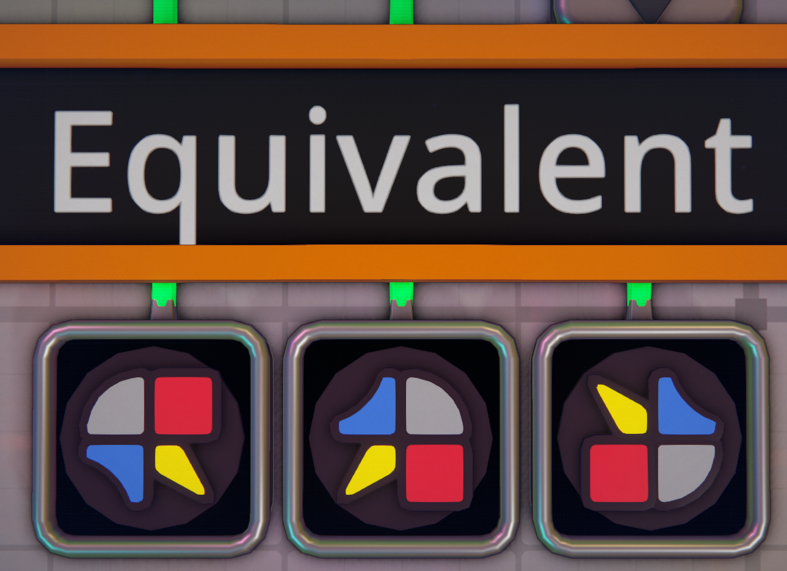
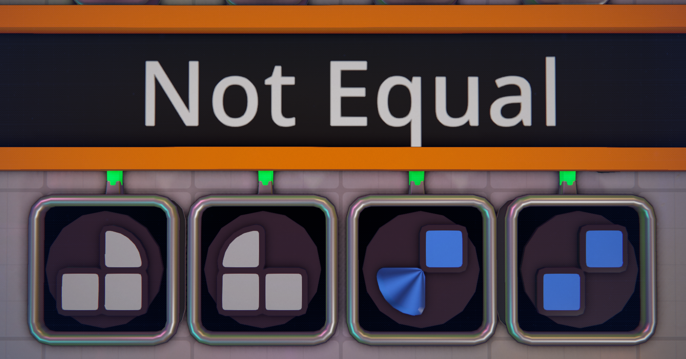

# The Problem
In a factory game about making shapes, there are a variety of outputs that exist, but they can also be rotated and still be considered equal.

 </br>

A shape is represented by a `shape code` which contains 8 pieces of information broken into 4 quadrants.</br>
Each quadrant is 2 characters, a shape and a color. In the example image above, the leftmost shape has the following code:
### RrSyWbCu
Rr - **R**ectangle + **r**ed</br>
Sy - **S**pike + **y**ellow</br>
Wb - Diamond (called **W**edge colloquially) + **b**lue</br>
Cu - **C**ircle + **u**ncolored</br>
 </br>

</br>

Shapes are **only** equivalent if they are able to be rotated to equal each other.

 </br>

The left pair of shapes are not equal because they are reflections of each other, not rotations. </br>
The right pair of shapes are not equal because the third quad is a blue *crystal* in one while a blue shape in the other. </br>
The difference between shapes and crystals is that shapes can be uncolored while crystals cannot.

In total there are 7 Colors (plus uncolored for 8), 4 Shapes, and 3 Non-shape segments:</br>
**Colors** - `u rgb cmy w` - uncolored (Shape only) red green blue cyan magenta yellow white</br>
**Shapes** - `CRSW` - Circle, Rectangle, Spike, Diamond</br>
**Non-shape** - `Pc-` - Pin, crystal, Gap

### Final Notes:
1. Shapes can exist in all 7 colors as well as uncolored.
2. Pins and Gaps do not have any color, so the color character of their quadrant in shape codes are `-`.
   - Ex: `CuRuRu` `--` or `Rr` `P-` `WbCu`.
3. crystals only exist in the 7 colors, and are represented in the shape code as a lowercase `c`.
   - Ex: `Rb--cb--`.</br>

More shape code examples:</br>
 </br>


# The Process
First, I would find the number unique quadrants to "flatten" out the complexity of shapes and colors</br>
There are:</br>
 - 4 shapes with 8 colors
 - 7 colors of crystal
 - pins
 - gaps

That makes (4*8)+7+2 = **41**

### V1 Solution:
To make the first solutions, I kept the idea of shape codes as strings, but replacing the Shape+color pair with just a single character from a set of 41 unique characters. This means that instead of a shape code being represented as `RrSyWbCu`, it may instead be represented as `A$@7`.

Iterating through the set of characters to make all possible strings, and then counting, will over-count. This is because it doesn't account for rotational equivalences.</br>
A shape has 4 rotational variants, but simply dividing the total count by 4 also won't work because shape rotations have overlap with each other. For example:</br>
`Cu--Cu--` and `--Cu--Cu`</br>
 </br>

So, for each shape created, I would rotate the shape to a standardized orientation (in this case the lexographical minimum) and add those standardized rotations to a set. I could then simply return the length of the set to have my answer.

```py3
for a in b41:
  for b in b41:
    for c in b41:
      for d in b41:
        combo = a+b+c+d
        resultSet.add(make_min(combo))
```

This has 3 main problems:
1. This answer over counts, because it counts `--------` as a valid shape when it should be excluded.
   - Simple enough fix, just -1 from the result.
2. This has a lot of repeated work. 
   - Every single shape is processed to find the minimum, which is an expensive calcuation that involves creating 4 strings and comparing them, regardless of if the shape counts as a new valid shape at all.
3. Sets are slow.
   - Every single time a shape is to be added, it must be hashed and placed somewhere in memory which may not be contiguous.

### V2 Solution:
With problem #1 solved, the next consideration was to make the processing step less expensive. This means that I replaced the strings with an int which I then interpret as base_41.</br>
All the logic used is the same, but now instead of breaking down and constructing 4 strings per shape, it's only doing 4 mathematical operations, which are faster to execute and compare.

This *did* result in some time saved, maybe 10-20%. However, after implementing this optimization, it became clear that most of the time spent on this calculation was from redundant work and the usage of a set, so then comes V3.

### V3 Solution:
Working on the premise that the set is the slowest part of the calculation, and now armed with the ability to represent shapes as an integer, a new process is enabled. Integers can be used to index an array, and arrays are very fast.</br>
Creating a boolean array of "found" shapes, len 41**4 filled and pre-filled `False`, I can then iterate `for i in range(41**4)`.

For each `i`, I can mark `found[i]` as `True`, and then create the other base_41 rotations of `i` and mark `found[i]` True for all 3 of those too. Then I'll increment a counter. Before processing `i`, all that needs to be done is to check `if found[i]`, and if it was a rotation of a previous shape then `found[i]` will already be true, allowing it to skip all the other processing.

```py3
for i in range(41**4):
   if found[i]:
      continue
   found[i] = True
   for j in rotations(i):
      found[j] = True
   count += 1
```

Purely from changing the data structure used, this now completely solves problem #2 AND problem #3, and the calculation time shows it. V3 is more than a **200%** increase in speed over V2.

Satisfied with my work, I shared it to the relevant community, and another member wondered how fast it would be in another language like C++. They implemented a solution more similar to V1, and it ran 10x faster than the now highly optimized V3 solution in Python. So now there is a new problem:

4. Python is slow

Python is slow because it's largely not compiled, and fundamentally cannot beat the speed of a pre-compiled language. So there are simply only 2 solutions to this. Either I can implement in a new language, or I can find a way to compile Python, which leads into...

# The Solution
Python is an extremely popular language among scientists for data processing and visualization. Because of this, there are many libraries in place which perform robust and complex calculations within Python, but implemented in C (NumPy). This is how I get C-like speeds from within Python, almost.</br>
The actual calculations being done in this program are individually quite simple, replacing any of the calcs with NumPy doesn't save much time at all.</br>
When researching ways to speed up Python, I learned about a library which is made to take NumPy code and fully compile functions as they are used, allowing for full speed comparable to C.

Integrating the changes finally results in a **more than 10x** speed up, which shows that this code now runs as fast or faster than a C++ implementation. This is the solution as it still stands.

Ultimately, though, surely there is a purely mathematical way to calculate this? Counting is not a new profession to people, and neither are circular strings.</br>
Sure enough, there is a way calculate the precise answer with no need for iterating and counting through every possible case. Implementing this math in pure Python with no optimizations, compilations, or non-standard libraries, calculates the full solution in a near instant 5e-6 seconds. Compared to V1, this is over **600,000** times faster, and the runtime growth is practically O(1) compared to the O(N**4) of the final, fully explicit counting solution.
